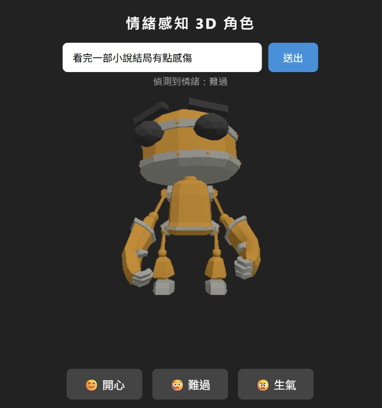

# 情緒感知 3D 角色 Demo

**Emotion-Aware 3D Avatar — A Minimal Prototype**

A web prototype in which a user's natural-language input is classified into an emotional
state by a large language model, and a 3D character reflects that state in real time
through morph-target facial expressions.

Built as the first-stage implementation of a graduate research proposal on
multimodal emotion-aware AI avatars in immersive VR environments.

**Live demo** → https://emotion-avatar.vercel.app

> ⏳ The backend runs on a free tier that sleeps when idle. The first request may take
> 30–60 seconds to wake the server. Subsequent requests are immediate.

---


## 一、專案動機

這個 Demo 是研究計畫《多模態情緒感知之元宇宙 AI 虛擬角色沉浸式互動系統
設計與實驗研究》的第一階段實作。

研究計畫關心的核心問題是：**在元宇宙沉浸式環境中，當 AI 虛擬角色能夠感知
並回應使用者的情緒狀態時，使用者的互動體驗會產生什麼差異？**

完整研究採用 2×2 受試者間設計，比較兩個因子：

|  | 無情緒感知 | 有情緒感知 |
|---|---|---|
| **Web 瀏覽器** | A 組（基準） | **B 組 ← 本 Demo 的位置** |
| **VR 頭戴設備** | C 組 | D 組（完整實驗組） |

**這個 Demo 實作的是 B 組的核心路徑**：
```
使用者的自然語言
↓
語言模型判讀情緒狀態
↓
具身化的角色即時反映
```

它刻意做到最薄 —— 只有三種情緒、只有三組 morph target、只有文字單一模態、
沒有 VR —— 但**三層是真的接起來的**。

距離完整研究還缺兩件事：**眼動作為第二模態**，以及**移植到 WebXR 頭戴設備**。
這兩項正是研究計畫的創新點所在。

---

## 二、線上 Demo

| | 網址 |
|---|---|
| 前端 | https://emotion-avatar.vercel.app |
| API 測試頁 | https://emotion-avatar-backend.onrender.com/docs |
| **後端原始碼** | https://github.com/UnaLin16/emotion-avatar-backend |
> 前端原始碼即本 repo。

### 操作方式

1. 在輸入框打一句話，例如「今天考試考差了」
2. 按送出，等待 AI 判讀
3. 3D 角色切換成對應的表情

也可以直接按下方三顆按鈕手動切換表情，跳過 AI 判讀。

### 實測範例

| 輸入 | 判讀結果 |
|---|---|
| 今天考試考差了心情很差 | 難過 |
| 終於放假了太開心 | 開心 |
| 同事又搶我的功勞 | 生氣 |



---

## 三、技術架構

```
任何人的瀏覽器
        ↓
Vercel（前端）    Vite + Three.js
        ↓  POST /detect  { "text": "..." }
Render（後端）    FastAPI + uvicorn
        ↓
OpenAI API（gpt-4o-mini）
        ↓  { "emotion": "難過" }
前端收到情緒標籤 → 切換 Morph Target → 角色變表情
```

### 三層各自負責什麼

| 層 | 技術 | 職責 |
|---|---|---|
| 前端 | Vite + Three.js | 3D 場景渲染、表情控制、使用者介面 |
| 後端 | FastAPI + uvicorn | 保管 API 金鑰、呼叫 LLM、回傳情緒標籤 |
| 模型 | OpenAI gpt-4o-mini | 自然語言 → 三分類情緒標籤 |


---

## 四、技術決策說明

這一節記錄的是**為什麼這樣選**，而不只是**用了什麼**。

### 4.1 為什麼一定要有後端

最初的想法是讓前端直接呼叫 OpenAI，這樣可以省掉整個後端。**這是錯的。**

```python
client = OpenAI(api_key="sk-proj-xxxxx")                    # ❌ 金鑰跟著程式碼跑
client = OpenAI(api_key=os.environ.get("OPENAI_API_KEY"))   # ✅ 程式碼裡只有「名字」
```

前端程式碼是公開可見的 —— 任何人按 F12 都能讀到。金鑰寫在前端，等於把鑰匙印在
玻璃門上。後端存在的唯一理由，就是**把金鑰藏在使用者看不到的地方**，前端只傳文字。


### 4.2 為什麼是 RobotExpressive，不是 Ready Player Me

原本規劃使用 Ready Player Me 產生擬真人形角色，但**該服務已於 2026 年 1 月停止
公開服務**。改評估 Mixamo 與 Sketchfab，問題是這兩處的角色 morph target 不一定齊全 ——
沒有表情資料的模型，再好看也無法用於表情驅動。

最終選用 Three.js 官方的 **RobotExpressive** 模型：可由 URL 直接載入、內建
Angry / Surprised / Sad 三個表情、授權清楚。

**取捨**：擬真度換取了可控性與可重現性。對一個驗證概念的 Demo 來說，後者更重要。

### 4.3 為什麼用 GPT API 判讀情緒，不用專門的情緒辨識模型

開發初期試過 HuggingFace 上的中文情緒分類模型（`bardsai/finance-sentiment-zh-base`），
結果對日常口語的判斷幾乎都回 neutral。原因是該模型以金融語料訓練，語域不符。

改用 **gpt-4o-mini** 搭配限制輸出的 system prompt：

```python
{"role": "system", "content": "你是情緒分析專家，只能回答「開心」、「難過」或「生氣」三個詞之一，不能有其他文字。"}
```

準確度明顯改善。**這裡的判斷是：與其找一個剛好適配的專用模型，不如用通用模型加上
嚴格的輸出約束。**

### 4.4 表情是怎麼被控制的

Morph Target（形變目標）的本質是一組 0 到 1 的數值陣列，控制模型從基準形狀往
目標形狀變形多少。

```javascript
const emotionMap = {
  '開心': [0, 0.3, 0],   // [Angry, Surprised, Sad]
  '難過': [0, 0,   1],
  '生氣': [1, 0,   0]
}
```

這個模型只有三個**整組表情**（不是分開控制眼睛、眉毛、嘴巴），而且沒有「開心」。
「開心」是借用 `0.3` 的 Surprised 近似出來的 —— 一個誠實的妥協。

---

## 五、已知限制

這一節寫的是這個 Demo **做不到什麼**。

### 5.1 情緒只有三類

開心 / 難過 / 生氣。真實的情緒互動遠比三分類複雜，也缺少強度（微怒 vs 暴怒）的維度。

### 5.2 表情是整組切換，不是連續變化

受限於模型的 morph target 設計，表情是離散跳變的，沒有過渡動畫，也無法組合出
「難過但強顏歡笑」這類混合狀態。

### 5.3 架構上繞不開的延遲 ← 這一項有研究意義

```
理想   使用者裝置 → 模型 → 角色反應
現實   使用者裝置 → 自建後端 → 模型 → 角色反應
                    ↑
                 金鑰必須藏在這裡
```

只要系統牽涉 LLM API，金鑰就必須放在伺服器端，這一跳無法省略 —— 它是**架構上的
必然成本**，不是實作不夠好。

免費部署方案的冷啟動（閒置後首次呼叫需 30–60 秒喚醒）更放大了這件事。

對「即時互動體驗」的研究來說，**延遲是一個必須被納入討論的變項**，而不是一個可以
假裝不存在的工程問題。

### 5.4 尚未驗證使用者體驗

這個 Demo 只證明了技術路徑可行，**沒有做任何使用者實驗**。研究計畫中的
2×2 實驗設計（60 位受試者、四個組別）尚未執行。

---

## 六、安裝與執行

> 大多數人直接點上方的線上 Demo 即可。以下是在本機執行的方式。

### 需求

- Node.js 18+
- Python 3.10+
- OpenAI API Key

### 前端

```bash
git clone https://github.com/UnaLin16/emotion-avatar.git
cd emotion-avatar
npm install
npm run dev
# → http://localhost:3000
```

本機執行時，需把 `src/main.js` 裡的 API 網址改回 `http://127.0.0.1:8000/detect`。

### 後端

```bash
git clone https://github.com/UnaLin16/emotion-avatar-backend.git
cd emotion-avatar-backend
pip install -r requirements.txt

# 設定金鑰（PowerShell）
$env:OPENAI_API_KEY="sk-..."

uvicorn main:app --reload --port 8000
# → http://127.0.0.1:8000/docs
```

### 部署設定（供參考）

| | 平台 | 關鍵設定 |
|---|---|---|
| 前端 | Vercel | 自動偵測 Vite，無需額外設定 |
| 後端 | Render | Build: `pip install -r requirements.txt`<br>Start: `uvicorn main:app --host 0.0.0.0 --port $PORT`<br>Env: `OPENAI_API_KEY` |

> `--port $PORT` 不可寫死。雲端平台每次開機分配的埠號不同，寫死會導致部署失敗。

---

## 七、未來可擴充方向

依「離目前實作的距離」排序：

| 方向 | 說明 | 對研究的意義 |
|---|---|---|
| 表情連續過渡 | 用補間動畫取代跳變 | 提升沉浸感，可作為體驗變項 |
| 情緒強度維度 | 從三分類改為情緒 + 強度 | 讓表情映射更細緻 |
| 對話脈絡保留 | 加入多輪對話記憶 | 情緒判斷從單句延伸到情境 |
| 語音輸入 | 語音轉文字 + 語調分析 | 進入多模態情緒辨識 |
| 移植到 VR | 從螢幕移到頭戴式裝置 | **接回研究計畫的核心場景** |
| 眼動作為第二模態 | 以眼動資料輔助情緒判讀 | 文獻上較少被驗證的組合 |

最後兩項是研究計畫真正想處理的部分。這個 Demo 是通往那裡的第一步。

---

## 八、專案結構

```
emotion-avatar/                前端
├── src/
│   ├── main.js                3D 場景 + API 呼叫 + 表情控制
│   └── style.css
├── index.html
├── vite.config.js
└── package.json

emotion-avatar-backend/        後端
├── main.py                    情緒辨識 API
├── requirements.txt
└── .gitignore
```

---

## 九、學習路徑

本專案為 28 天學習計畫的產出：

```
Day 1–14    Python 與 OpenAI API 基礎（多輪對話、System Prompt、FastAPI）
Day 15–21   Three.js 場景建置、模型載入、Morph Target 表情控制
Day 22–25   前後端串接、情緒驅動表情、UI 優化
Day 26      部署上線（Render + Vercel）
Day 27–28   文件整理與 Demo 影片
```


